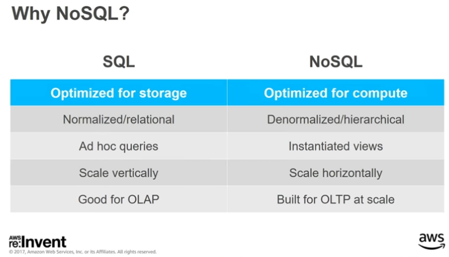
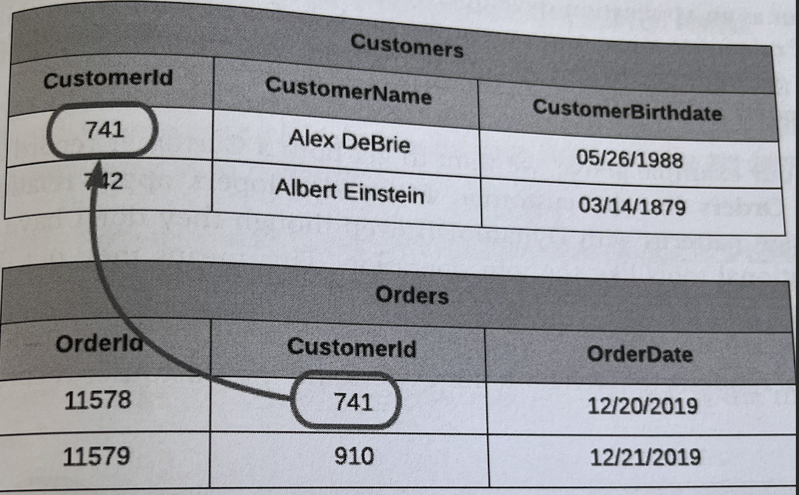
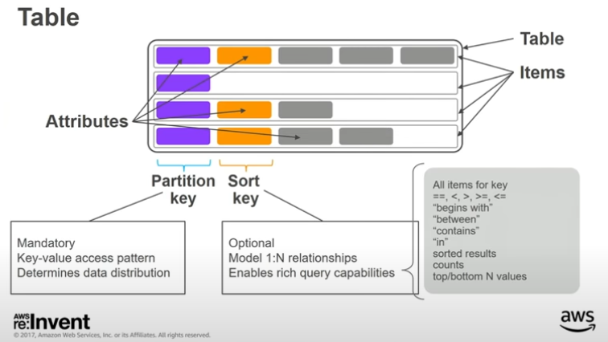
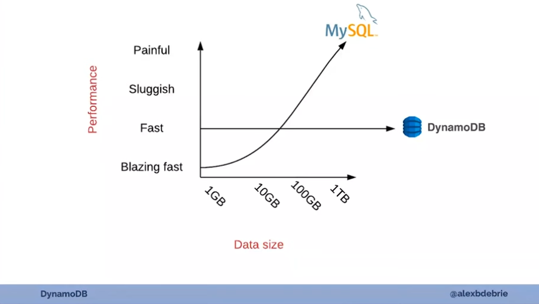
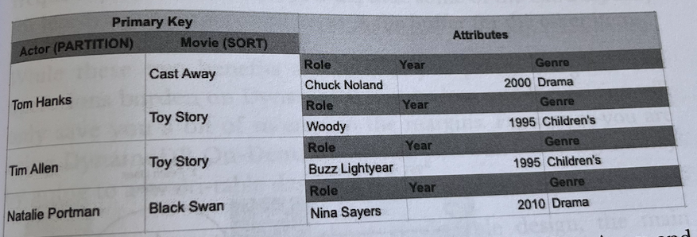
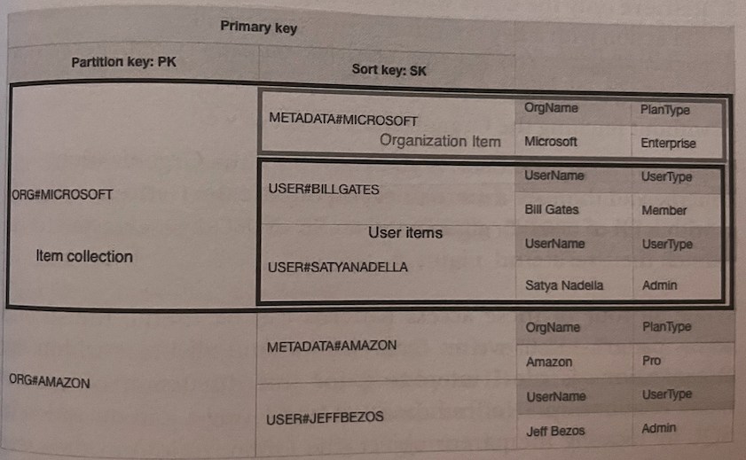
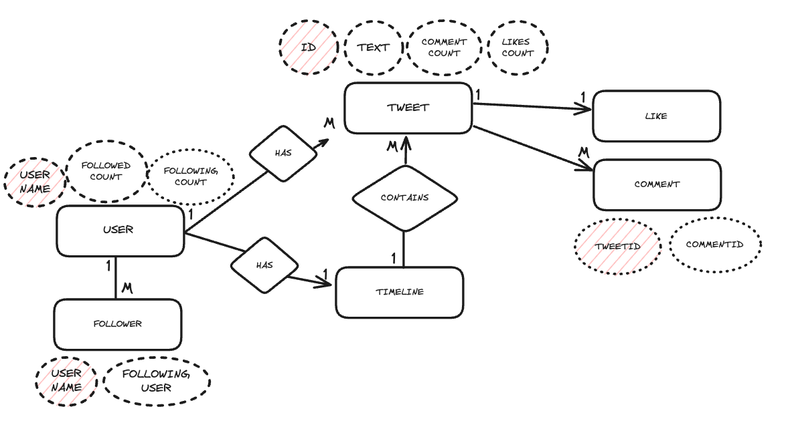
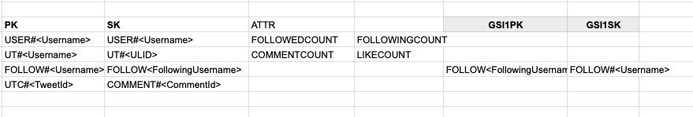

# Single-table Design with DynamoDB

## Intro
DynamoDB is one of the NoSQL databases if the NoSQL terminology is right way to declare it. Here's you can find basic differences between NoSQL and SQL databases.



If we're running OLTP applications which are mostly apps we build today, when the button gets clicked it interacts with the database. In this case NoSQL can be a good choice because it's optimized for the compute and scalable. see for the differences.

### Background on SQL modeling & joins
With relational databases, you generally normalize your data by creating a table for each type of entity in your application.
For example, if you're making an e-commerce application, you'll have one table for customers and one table for Orders.



Each Order belongs to a certain Customer(add. benefits [Insertion,Update,Delete anomalies]), and you use foreign keys to refer from a record in one table to a record in another. These foreign keys act as pointers -- If I need more information about a Customer that placed a particular Order, I can follow the foreign key reference to retrieve items about the Customer.

Joins allow you to combine records from two or more tables at read-time.

## DynamoDB
DynamoDB is a fully managed AWS product for NoSQL databases. 



###  There are no joins in DynamoDB
SQL joins are also expensive (think these are memory pointers). They require scanning large portions of multiple tables in your relational database, comparing different values, and returning a result set.

DynamoDB closely guards against any operation that won't scale, and there's not a great way to make relational joins scale. Rather than working to make joins scale better, DynamoDB sidesteps the problem by removing the ability to use joins at all.

There're no joins in DynamoDB, they'll need to make multiple, serial requests to fetch both the Orders and the Customer record.



Not scalable by nature: https://www.youtube.com/watch?v=6yqfmXiZTlM&t=1580s


### The solution: Pre-join your data into item collections and Single Table Design

An item collection in DynamoDB refers to all the items in a table or index that share a partition key. In the example below, we have a DynamoDB table that contains actors and the movies in which they have played. The primary key is a composite primary key where the partition key is the actor's name and the sort key is the movie name.


You can see there are two items for Tom Hanks - Cast Away and Toy Story. Because they have the same partition key of Tom Hanks. They are in the same item collection.



You can use DynamoDB's Query API operation to read multiple items with the same partition key. Thus, if you need to retrieve multiple heterogeneous items in a single request, you organize those items so that they are in the same item collection.

This is what single-table design is all about - tuning your table so that your access patterns can be handled with as few requests to DynamoDB as possible, ideally one.

### Downsides of a single-table design

- The steep learning curve to understand single-table design.
- The inflexibility of adding new access patterns.
    If your access patterns change because you're adding new objects or accessing multiple objects in different ways, you may need to do an ETL process to scan every item in your table and update it with new attributes. This adds friction to your development process.
- The difficulty of exporting your tables for analytics.
    DynamoDB is designed for online transactional processing (OLTP), but the DynamoDB is not good at OLAP queries. This is intentional.


### STD Data Modeling Demo

#### Things to do for data modeling
    1. Understand your application
    2. Create an entity-relationship diagram (ERD)
    3. Write out all of your access patterns
    4. Model your primary key structure
    5. Satisfy additional access patterns with secondary indexes and streams

1. Understand your application

We're going to implement twitter without a timeline feature(it needs a more complex solution and is out of topic right now). Of course it'll cover most basic features right now. Let's get started.

Firstly we need to create some entities for our applications.

Entities:
- User
- Tweet
- Timeline
- Like
- Comment
- Follower

2. Create ERD(Entity-Relationship Diagram)



3. Write out all of your access patterns


4. Model your primary key structure



### Demo

Let's deploy the code, invoke lambdas and populate the table to see the result.


```bash
Service: std-with-ddb
Endpoints:
  POST - https://*********.execute-api.us-east-1.amazonaws.com/dev/users
  GET - https://*********.execute-api.us-east-1.amazonaws.com/dev/users/{username}
  POST - https://*********.execute-api.us-east-1.amazonaws.com/dev/users/{username}/tweets
  GET - https://*********.execute-api.us-east-1.amazonaws.com/dev/users/{username}/tweets/{tweetId}
  POST - https://*********.execute-api.us-east-1.amazonaws.com/dev/users/{username}/tweets/{tweetId}/likes
  GET - https://*********.execute-api.us-east-1.amazonaws.com/dev/users/{username}/tweets/{tweetId}/likes
  POST - https://*********.execute-api.us-east-1.amazonaws.com/dev/users/{username}/tweets/{tweetId}/comments
  GET - https://*********.execute-api.us-east-1.amazonaws.com/dev/users/{username}/tweets/{tweetId}/comments
  POST - https://*********.execute-api.us-east-1.amazonaws.com/dev/users/{username}/followers
  GET - https://*********.execute-api.us-east-1.amazonaws.com/dev/users/{username}/followers
  GET - https://*********.execute-api.us-east-1.amazonaws.com/dev/users/{username}/following
  ...
```

Modeling Documentation Link: https://docs.google.com/spreadsheets/d/12bi05TAes_OxXC5RvDlZdj3RlFQ64fwRAD4mQry26gM/edit?usp=sharing

### Demo Source Links
- Link1[https://www.youtube.com/watch?v=Q6-qWdsa8a4]
- Link2[https://github.com/alexdebrie/dynamodb-instagram]

## References
- Link1[https://www.dynamodbbook.com/]
- Link2[https://www.youtube.com/watch?v=jzeKPKpucS0]
- Link3[https://www.youtube.com/watch?v=Q6-qWdsa8a4]


